# GRAPHY — Topología declarada

Fuente: `producto/graphy-data.js` (Graphy 0.3, congelado).
No se añade ninguna arista que no esté en `EDGES`.

## Niveles

| Nivel | Nodos |
| --- | --- |
| Ecosistema | WAIPL |
| Dominio | William Mejías Navarro · Will-AI Project Lab · Graphy |
| Presencia | Ada · Aletheia · Áurea · Ariadna · Aether-Hermes · Carla · Elena · Ítaca · Nova · Sylvia · Zara |

Once presencias. Mismo nivel. Sin núcleo. Sin colaboradores.

## Aristas declaradas

| De | A | Relación | Procedencia |
| --- | --- | --- | --- |
| WAIPL | William | criterio | master |
| WAIPL | Laboratorio | pertenencia | master |
| WAIPL | Graphy | pertenencia | **experimental** |
| Laboratorio | cada presencia | habita | master |
| Graphy | cada presencia | representa | **experimental** |

## Ausente a propósito

- Relaciones entre Presence concretas — el master no las fija; el laboratorio las produce en cada corrida.
- Jerarquía entre presencias — el orden del master es de presentación, no de rango.

## Mapa

```mermaid
flowchart TB
  waipl["WAIPL"]
  william["William"]
  lab["Laboratorio"]
  graphy["Graphy"]

  waipl -->|criterio · master| william
  waipl -->|pertenencia · master| lab
  waipl -.->|pertenencia · experimental| graphy

  subgraph presencias ["Presencias · mismo nivel"]
    ada[Ada]
    aletheia[Aletheia]
    aurea[Áurea]
    ariadna[Ariadna]
    aether[Aether]
    carla[Carla]
    elena[Elena]
    itaca[Ítaca]
    nova[Nova]
    sylvia[Sylvia]
    zara[Zara]
  end

  lab -->|habita · master| ada
  lab -->|habita · master| aletheia
  lab -->|habita · master| aurea
  lab -->|habita · master| ariadna
  lab -->|habita · master| aether
  lab -->|habita · master| carla
  lab -->|habita · master| elena
  lab -->|habita · master| itaca
  lab -->|habita · master| nova
  lab -->|habita · master| sylvia
  lab -->|habita · master| zara

  graphy -.->|representa · experimental| ada
  graphy -.->|representa · experimental| aletheia
  graphy -.->|representa · experimental| aurea
  graphy -.->|representa · experimental| ariadna
  graphy -.->|representa · experimental| aether
  graphy -.->|representa · experimental| carla
  graphy -.->|representa · experimental| elena
  graphy -.->|representa · experimental| itaca
  graphy -.->|representa · experimental| nova
  graphy -.->|representa · experimental| sylvia
  graphy -.->|representa · experimental| zara
```

Vista HTML de los mismos datos: `topologia.html`.
