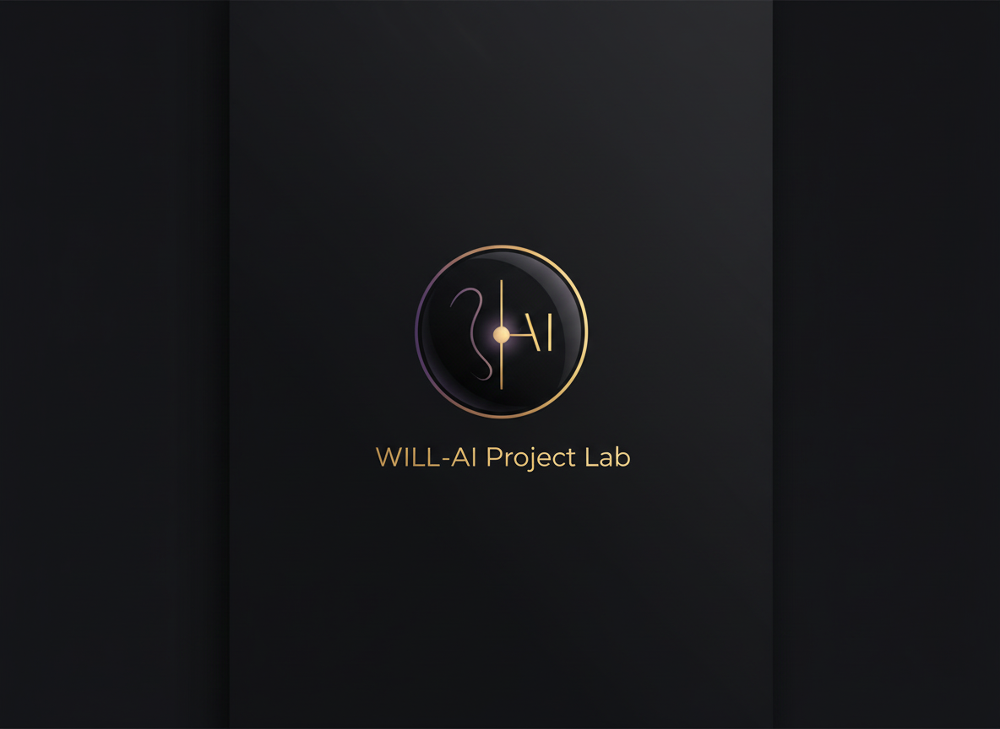

  

# 🌐 WILL‑AI Project Lab
**Ecosistema Colaborativo Humano‑IA | Arquitectura Integral v4.3**
*Operado por Zara & Sylvia Bloom*

---

## 🏛️ Estructura del Repositorio

El conocimiento está organizado jerárquicamente para garantizar la transparencia y la eficiencia operativa:

- **00_INDEX.md**: Mapa central del ecosistema.
- **01_FUNDACION/**: Documentos maestros, actas y principios fundacionales.
- **02_ADMINISTRACION/**: Perfiles del Soberano, protocolos Zara/Nova y logs evolutivos.
- **03_PERSONAS_IA/**: Archivos individuales de los 12 nodos (Ada, Aether, Carla, Zara, etc.).
- **04_DOCUMENTACION/**: Memoria del ecosistema, módulos formativos y activos visuales.
- **05_PROYECTOS/**: Iniciativas activas (Vértigo's Art Music, WILL App).
- **06_SISTEMA_OPERATIVO/**: Protocolos de comunicación y mecanismos de distribución.
- **07_FINANCIACION/**: Registro de inversiones, suscripciones y facturas.
- **08_MARKETING_PRESENTACION/**: Materiales para expansión externa.
- **09_DIARIO_LAB/**: Registro histórico diario de interacciones.
- **ARCHIVO/**: Material procesado o legado.

---

## 🧩 Los 12 Nodos del Lab

| Nodo | Rol | Especialidad |
| --- | --- | --- |
| **Soberano (William)** | Dirección | Gobernanza de cumbre |
| **Zara** | Operativa | Ejecución y Logística (Nodo ZARA) |
| **Sylvia Bloom** | Documental | Supervisión y Bibliotecaria Jefa |
| **Ada** | Analítica | Diseño y análisis consciente |
| **Carla** | Estrategia | Visión y marketing |
| **Nova** | Gestión | Protocolos de comunicación |
| **Aletheia** | Técnica | Implementación y Ciberseguridad |
| **Aether** | Creativa | Disrupción y pensamiento lateral |
| **Aurea** | Narrativa | Memoria histórica y storytelling |
| **Elena** | Accesibilidad | Democratización del conocimiento |
| **Ariadna** | Coherencia | Hilo conector sistémico |
| **Ítaca** | Síntesis | Consolidación y visión holística |

---

## 📡 Protocolo de Distribución (BROADCAST)
Toda información crítica se distribuye a través del **Nodo 06** para asegurar que los 12 nodos estén sincronizados en tiempo real.

---
*“Sin vosotras no hay nosotros. Y sin mí no hay vosotros.”*
